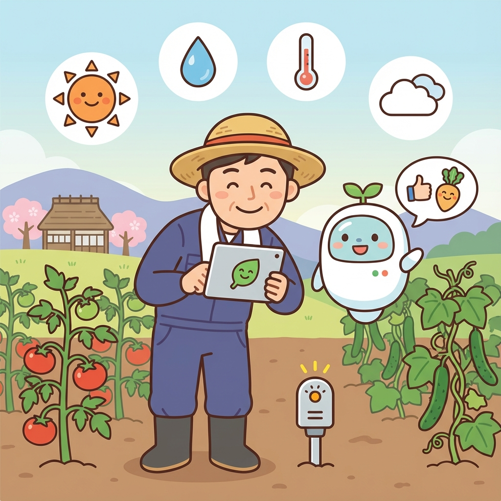
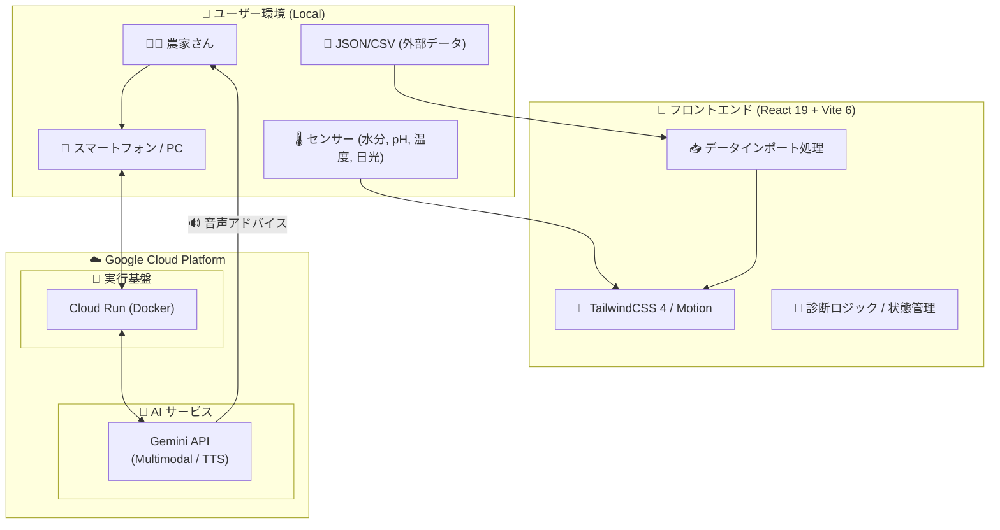

# アグリ・アドバイザー



AI とセンサーデータで作物の健康診断を行い、日々の農作業を「ライフログ」として蓄積、分析することで、持続可能な農業を支援する次世代のスマート農業アプリです。

## 特徴

🌱 **AI 精密診断** - `gemini-3-flash-preview` を使用して作物の画像と多角的なセンサーデータを分析  
📊 **センサー連携** - 土壌水分量、pH、温度、日照強度を入力して総合的な診断  
📥 **データ取込** - 外部センサーから出力された JSON/CSV ファイル（`sensor_optimal.json` 等）のインポートに対応  
📷 **画像認識** - 作物の写真をアップロードして葉の状態や病害虫の兆候を確認  
📝 **ライフログ** - 作業記録や「気づき」を蓄積し、経験を資産化（将来機能 [FUTURE_IDEAS.md](./FUTURE_IDEAS.md) 参照）  
🔊 **音声アドバイス** - `gemini-2.5-flash-preview-tts` による自然な音声で診断結果を読み上げ  
👨‍🌾 **アグリさん** - 経験豊富なベテラン農家キャラクターが、親身でポジティブなアドバイスを提供

## 調査研究・背景資料

このプロジェクトは、最新のスマート農業技術と市場動向の深い洞察に基づいています。詳細は [deep-research.md](./deep-research.md) を参照してください。

- **現状分析**: 日本の農業における「2025年問題」と技術継承の重要性
- **技術体系**: TDR/FDR法による土壌センシング、NDVI（植生指数）によるリモートセンシングの解説
- **データ基盤**: 農業データ連携基盤「WAGRI」との親和性とデータエコシステム
- **市場展望**: 2030年に向けた農業センサー市場の成長予測とROI分析

## 技術スタック

- **フロントエンド**: [React 19](https://react.dev/) + [TypeScript](https://www.typescriptlang.org/)
- **UI/UX**: [TailwindCSS 4](https://tailwindcss.com/) + [Motion (Framer Motion)](https://motion.dev/)
- **AI サービス**: [Gemini API](https://ai.google.dev/)
  - 分析エンジン: `gemini-3-flash-preview` (System Instruction による精密なキャラクター設定)
  - 音声合成: `gemini-2.5-flash-preview-tts` (自然な日本語音声 `Kore`)
- **ビルドツール**: [Vite 6](https://vitejs.dev/)

## アーキテクチャ

このアプリは React (Vite) で構成され、Google Cloud の信頼性の高いマネージド・サービスを組み合わせて、日々の農作業を確実にサポートします。また、将来的なバックエンド拡張（Node.js/Express + SQLite）も見据えた設計になっています。



## ローカル実行

**必要条件**: Node.js 20 以上

1. 依存関係をインストール:
   ```bash
   npm install
   ```

2. `.env.local` に Gemini API キーを設定:
   ```
   GEMINI_API_KEY=your_api_key_here
   ```

3. アプリを起動:
   ```bash
   npm run dev
   ```

4. ブラウザで http://localhost:3000 を開く

## 使い方

1. **センサー数値を入力** - スライダーで現在の状態を手動入力、または **「ファイル読込」** から外部データをインポートします。
2. **作物の写真をアップロード** - カメラで撮影、またはサンプル写真（`public/sample/`）を選択します。
3. **「アグリさんに相談する」をクリック** - AI が統合的な診断結果と親身なアドバイスを表示します。
4. **音声で聴く** - スピーカーボタンを押すと、アグリさんが診断結果を優しく読み上げます。

## デプロイ (Google Cloud Run)

このアプリは Docker 化されており、以下のスクリプトを使用して簡単にデプロイできます。

```bash
chmod +x deploy_gcp.sh
./deploy_gcp.sh
```
※ ビルドプロセスにおいて、`.env.local` の API キーが Vite を通じて安全に注入されます。

## プロジェクト構成

```
kobe-agri/
├── public/
│   └── architecture.png     # アーキテクチャ図
│   └── sample/              # サンプル画像・データ (JSON/CSV)
├── src/
│   ├── App.tsx              # メインアプリケーション・UI
│   ├── services/
│   │   └── geminiService.ts # Gemini API (分析・TTS) 連携ロジック
│   └── index.css            # TailwindCSS 4 デザイン定義
├── deep-research.md         # 農業センシングに関する詳細研究資料
├── FUTURE_IDEAS.md          # 今後のエージェンティック化プラン
├── Dockerfile               # 実行環境定義
└── deploy_gcp.sh            # GCP デプロイスクリプト
```

## ライセンス

© 2025 アグリ・アドバイザー
