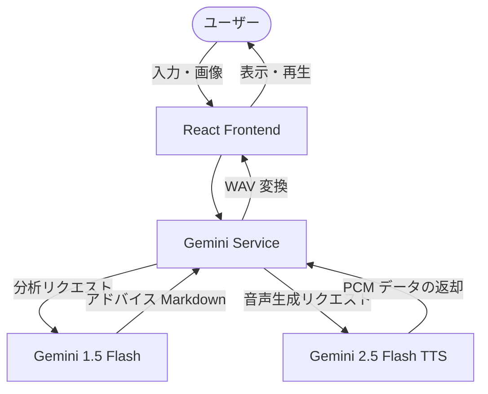

# アグリ・アドバイザー (Agri-Advisor)

AI とセンサーデータで農作物の健康状態を診断し、最適な育て方をアドバイスするスマート農業支援アプリです。

## 特徴

🌱 **AI 診断** - Gemini を使用して作物の画像とセンサーデータを分析  
📊 **センサー連携** - 土壌水分量、pH、EC（電気伝導度）を入力して総合的な診断  
📷 **画像認識** - 作物の写真をアップロードして葉の状態を確認  
🔊 **音声アドバイス** - 診断結果を Gemini TTS で読み上げ  
👨‍🌾 **アグリさん** - ベテラン農家キャラクターが親身にアドバイス

## 将来的な拡張プラン (エージェンティック化)

このプロジェクトをさらに進化させるためのアイデア（マルチアドバイザー、コミュニティ共有、自律的プランニングなど）を [FUTURE_IDEAS.md](./FUTURE_IDEAS.md) にまとめています。

## 技術スタック

- **フロントエンド**: React 19 + TypeScript
- **UI**: TailwindCSS 4 + Motion (Framer Motion)
- **AI**: Gemini API (`gemini-3-flash-preview` / `gemini-2.5-flash-preview-tts`)
- **ビルド**: Vite 6

## アーキテクチャ

アプリは React (Vite) で構成され、Gemini API と直接通信します。



## ローカル実行

**必要条件**: Node.js

1. 依存関係をインストール:
   ```bash
   npm install
   ```

2. `.env.local` に Gemini API キーを設定:
   ```
   GEMINI_API_KEY=your_api_key_here
   ```

3. アプリを起動:
   ```bash
   npm run dev
   ```

4. ブラウザで http://localhost:3000 を開く

## 使い方

1. **センサー数値を入力** - スライダーで土壌水分量、pH、温度、日光を調整
2. **作物の写真をアップロード** - カメラで撮影またはサンプル写真を選択
3. **「アグリさんに相談する」をクリック** - AI が診断結果とアドバイスを表示
4. **音声で聴く** - スピーカーボタンでアドバイスを読み上げ

## プロジェクト構成

```
kobe-agri/
├── public/
│   └── sample/              # サンプル画像・データ
│       ├── sensor_optimal.json
│       ├── sensor_dry.csv
│       └── *.jpeg           # 各種画像
├── src/
├── index.html
└── package.json
```

## ライセンス

© 2025 アグリ・アドバイザー
